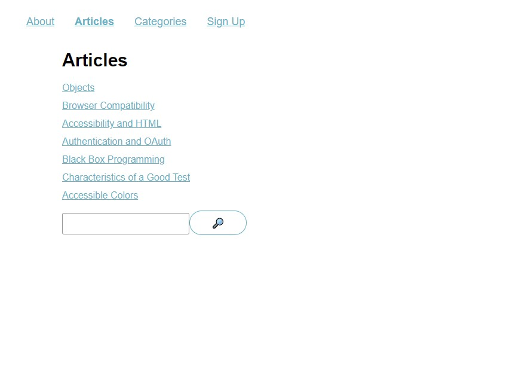

# React Router Lesson v6

## Table of contents

- [Overview](#overview)
  - [The challenge](#the-challenge)
  - [Screenshot](#screenshot)
  - [Links](#links)
- [My process](#my-process)
  - [Built with](#built-with)
  - [What I learned](#what-i-learned)
  - [Continued development](#continued-development)
  - [Useful resources](#useful-resources)
- [Author](#author)
- [Acknowledgments](#acknowledgments)

## Overview

### The challenge

Users should be able to:

- View the optimal layout for the app depending on their device's screen size
- Navigate through various pages and links within the application.
- Utilize the search functionality to find relevant articles.
- Set up a new user profile with personalized details.
- Update or modify the display name of your profile.

### Screenshot

### Links

- Live Site URL: [View](https://reactrouterv6lesson.netlify.app/)

## My process

- Install `react-router-dom` and add it to a React application.
- Enable routing by using `RouterProvider` and providing a `router`.
- Creating a router using `createBrowserRouter()`.
- Use `createRoutesFromElements()` to configure a router.
- Use the `Route` component to add static and dynamic routes to an application.
- Use `Link` and `NavLink` components to add links to an application.
- Access the values of URL parameters using React Router’s `useParams` hook.
- Create nested routes using `Route`, `Outlet`, and relative `path`s.
- Declaratively redirect users by rendering React Router’s `Navigate` component
- Imperatively redirect users via the `useNavigate` hook.
- Access and set the value of query parameters using React Router’s `useSearchParams` hook.

### Built with

- Semantic HTML5 markup
- CSS custom properties
- Flexbox
- Mobile-first workflow
- Mobile-Responsive Design
- JavaScript - Scripting language
- [React](https://reactjs.org/) - JS library
- [Next.js](https://nextjs.org/) - React framework

### What I learned

This was part of the lesson learning of react rounter.

### Continued development

Use this section to outline areas that you want to continue focusing on in future projects. These could be concepts you're still not completely comfortable with or techniques you found useful that you want to refine and perfect.

### Useful resources

- [Example resource 1](https://www.example.com) - This helped me for XYZ reason. I really liked this pattern and will use it going forward.
- [Example resource 2](https://www.example.com) - This is an amazing article which helped me finally understand XYZ. I'd recommend it to anyone still learning this concept.

**Note: Delete this note and replace the list above with resources that helped you during the challenge. These could come in handy for anyone viewing your solution or for yourself when you look back on this project in the future.**

## Author

- Website - [Cameron Howze](https://camkol.github.io/)
- Frontend Mentor - [@camkol](https://www.frontendmentor.io/profile/camkol)
- GitHub- [@camkol](https://github.com/camkol)
- LinkedIn - [@cameron-howze](https://www.linkedin.com/in/cameron-howze-28a646109/)
- E-Mail - [cameronhowze4@outlook.com](mailto:cameronhowze4@outlook.com)
